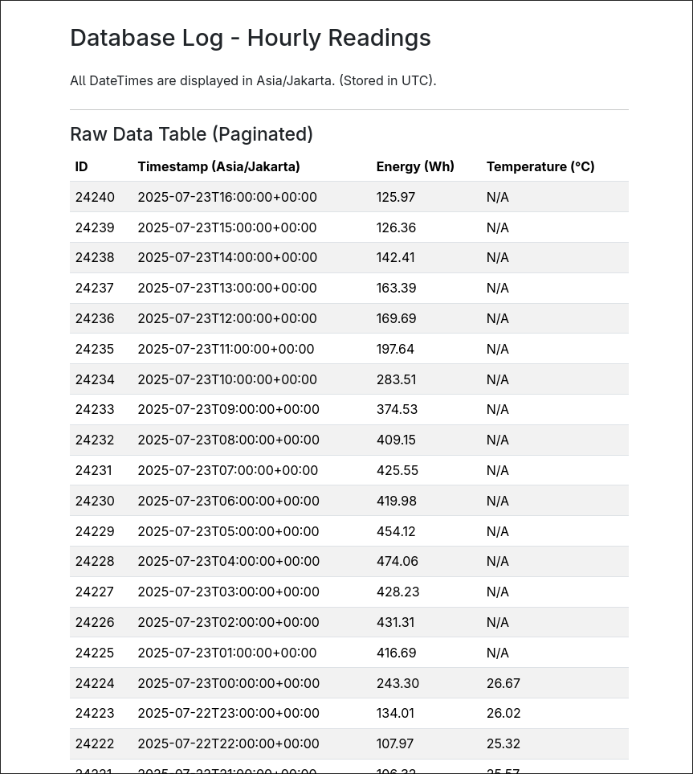
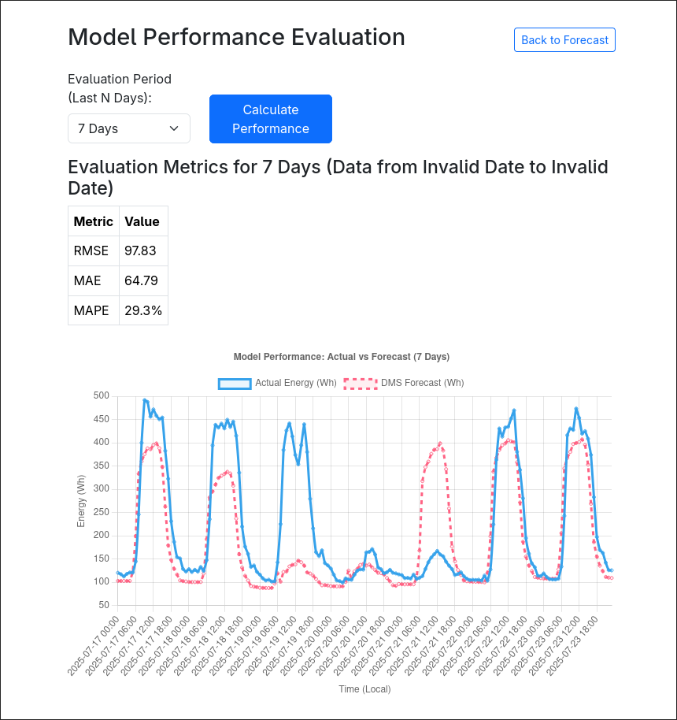

# XGBoost-Based Single-Building Electricity Usage Forecast

<div align="center">

</div>

This repository is an end-to-end system for forecasting the electricity of a building using historical data with time-based features and local ambient temperature using XGBoost

# Main Features

## 1. Pick Prediction Window


<div align="center">

</div>

## 2. Database Log


<div align="center">

</div>

## 3. Model Evaluation


<div align="center">

</div>


# Data

Data used for initial training is obtained from Electrical Engineering building from Universiti Malaya Campus, realtime data for current energy usage and ambient temperature can be fetched from Antares ioT platform and OpenMeteo API respectively

# Usage

## (Optional) If realtime features are needed
1. Acquire/ make a device capable of measuring building energy usage (Wh) and transmitting that data to Antares IoT platform (I used a PZEM-004T to measure energy and an ESP32 to transmit to Antares)
2. Make an Antares IoT account, go ahead and complete device registration
3. Make sure that one of the parameters sent to Antares is DailyEnergy (Energy measurement that resets everyday to 0), I have provided an example json that I used at `utils/example_antares.json`

## Install prerequisite libraries
First install the prerequisite python libraries required to run the local web server
```bash
pip install requirements.txt
```

## Run the server
Web server is started by executing the main python file `app.py`
```bash
python app.py
```
Modules in use are located in lib foder, the rest is for initial model training and other secondary features