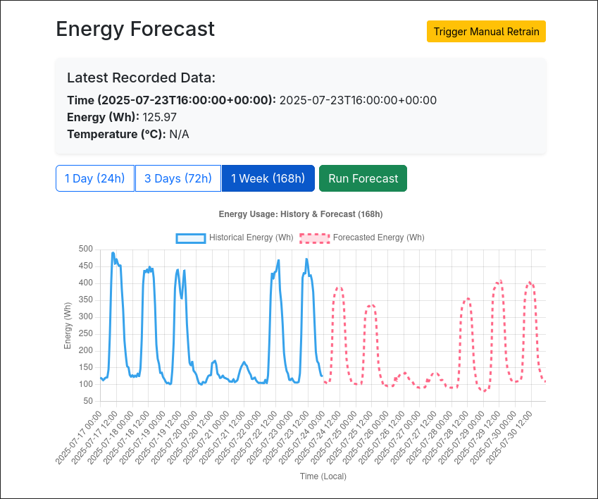

# XGBoost-Based Single-Building Electricity Usage Forecast

This repository is a system for forecasting the electricity of a building using historical data with time-based features and local ambien temperature

# Features

## 1. Pick Prediction Window

## 2. Database Log

## 3. Model Evaluation

# Data

Data used for initial training is obtained from Electrical Engineering building from Universiti Malaya Campus, realtime data for current energy usage and ambient temperature can be fetched from Antares ioT platform and OpenMeteo API respectively

# Usage

Web server is started by executing the main python file app.py
Modules in use are located in lib foder, the rest is for initial model training and other secondary features
